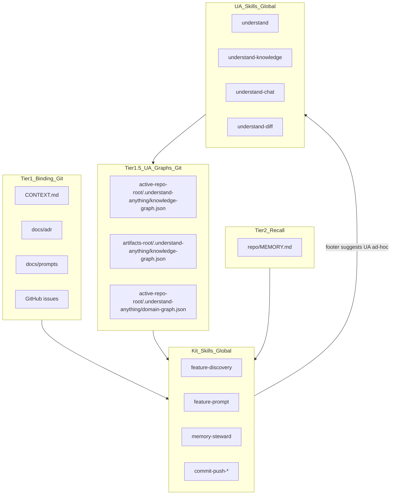

# agent-skills-kit + Understand-Anything integration plan

Status: **Applied** — kit skill edits merged; reinstall kit skills globally (Step C) then run `/agents-md`.

Human-facing integration reference. Do not load into `AGENTS.md` wholesale — the generated **Knowledge retrieval order** block comes from the `agents-md` skill template.

## Goal

Integrate [Understand-Anything](https://github.com/Lum1104/Understand-Anything) (UA) as **optional Tier 1.5 structural/doc retrieval** alongside the kit's git SSOT (CONTEXT, ADRs, MEMORY, issues). UA skills are **global** via `npx skills add Lum1104/Understand-Anything -g -y`. Per-repo artifacts live in git.

## Layer model

```text
Tier 1 — Binding (git)
  CONTEXT.md, docs/adr/, docs/prompts/, GitHub issues

Tier 1.5 — UA graphs (git, index-only orientation)
  <active-repo-root>/.understand-anything/knowledge-graph.json
  <active-repo-root>/.understand-anything/domain-graph.json (optional)
  <artifacts-root>/.understand-anything/knowledge-graph.json (docs/wiki)

Tier 2 — Recall index
  <repo-root>/MEMORY.md (≤300 lines, /memory-steward)

Tier 0 — Code
```

**Rule:** ADRs and CONTEXT always win over UA summaries.

## Decisions (locked in)

| Topic | Choice |
| :--- | :--- |
| Graph commits | **All matrix repo roots + `<artifacts-root>`**; git-lfs if any JSON exceeds ~10MB |
| Graph refresh | **Ad-hoc only** via existing `Suggested next skills (optional)` footer — never `--auto-update` hooks or forced runs |
| Large repos | **Full `/understand`** on every repo root (no scoped subgraph default) |
| SSOT | CONTEXT + ADRs + MEMORY win over UA summaries |
| Session start | **No** auto-invoke UA (unlike `/memory-steward` light pass) |
| **Kit scope** | **Generic / open-source only** — `<artifacts-root>`, `<repo-root>`, Project Matrix placeholders; **zero project-specific paths, names, or examples anywhere in the kit repo** |

## Design principle — workspace-agnostic kit skills

Phase 3 edits target **any project topology**. No customer, employer, or private workspace identifiers in the open-source kit — not in skills, GUIDE, README, or this doc.

Reuse the kit's existing resolution rules from [`skills/agents-md/SKILL.md`](../skills/agents-md/SKILL.md):

| Placeholder | Resolves to |
| :--- | :--- |
| `<artifacts-root>` | Dir with `*.code-workspace`; else `CONTEXT-MAP` context root; else single repo root |
| `<repo-root>` | Active Project Matrix `Path` + cwd (git walk-up); meta `path: "."` has no `MEMORY.md` |
| `<active-repo-root>` | Git root for cwd, or matrix row being edited |

**UA graph locations (generic):**

| Topology | Code graph | Docs / wiki graph |
| :--- | :--- | :--- |
| **Single repo** | `<repo-root>/.understand-anything/knowledge-graph.json` | Same root if markdown wiki lives there |
| **Monorepo** | Root or package path per matrix / where code lives | `<artifacts-root>/.understand-anything/…` if docs centralized |
| **VS Code multi-root** | One graph per matrix row `<Path>` (each folder root) | `<artifacts-root>/.understand-anything/…` when workspace has shared docs |
| **Meta-workspace** | Per code repo in matrix | `<artifacts-root>/.understand-anything/…` after `/understand-knowledge` |

Skills **never** hardcode repo names, absolute paths, or customer-specific concepts — only "when `<artifacts-root>` differs from `<active-repo-root>`".

## Architecture



## Ownership — agent vs operator

**The agent will NOT:**

- Run agent-skills-kit slash skills (`/agents-md`, `/feature-discovery`, `/memory-steward`, etc.)
- Run `npx skills install` or `npx skills add` for this kit on the operator's behalf
- Run `/understand`, `/understand-knowledge`, or other UA skills on operator repos
- Commit graph or kit changes unless explicitly asked

**The operator runs manually** — see checklist below.

## Operator checklist (when to do what)

### Prerequisites (local, private — not in kit)

| Step | Command / action |
| :--- | :--- |
| UA skills (global) | `npx skills add Lum1104/Understand-Anything -g -y` |
| Plugin core | Build UA plugin; `~/.understand-anything-plugin` symlink |
| Per-repo bootstrap | `.understand-anything/config.json`, `.gitignore`, scan preflight (operator script) |
| Optional docs wiki | Karpathy-style `index.md`, `docs/wiki/`, `log.md` at `<artifacts-root>` |

### Step A — Generate graphs

**When:** Before using `/understand-chat` or expecting graphs in git. One repo root per session is fine.

```text
/understand <active-repo-root>          # repeat for each Project Matrix row Path
/understand-knowledge <artifacts-root>  # when docs wiki lives at artifacts root
```

**Suggested order:** smallest scan preflight first, largest last. Use each repo's `.understand-anything/intermediate/scan-preflight.json` if present.

Commit in each root:

- `.understand-anything/knowledge-graph.json`
- `.understand-anything/meta.json`
- `.understand-anything/config.json`

Do **not** commit `intermediate/`, `diff-overlay.json`, `tmp/`.

Optional after each code graph: `/understand-domain`.

If any JSON exceeds ~10MB:

```gitattributes
.understand-anything/*.json filter=lfs diff=lfs merge=lfs -text
```

### Step B — Kit file changes land in agent-skills-kit repo

**When:** When the operator tells the agent **"execute the plan"** (Phase 3 edits only — SKILL.md, GUIDE.md, this doc).

### Step C — Reinstall / refresh agent-skills-kit skills globally

**When:** **Immediately after** Step B is merged or pulled.

```bash
npx skills add <your-kit-source> --skill agents-md -g -y
npx skills add <your-kit-source> --skill feature-discovery -g -y
npx skills add <your-kit-source> --skill feature-prompt -g -y
npx skills add <your-kit-source> --skill memory-steward -g -y
# … or:
npx skills update -g -y
```

Restart CLIs after install. **Do not run Step C before Step B.**

### Step D — Generate `AGENTS.md` for your workspace

**When:** **After Step C** (updated `/agents-md` skill installed).

```text
/agents-md
```

Open your `*.code-workspace` or repo root. Verify Operating Protocol includes **Knowledge retrieval order**. Also run **`/memory-steward`** once if MEMORY scaffolds are not yet in place.

### Step E — Validate integration

**When:** **After Steps A + D**.

1. Pick one real feature → `/feature-discovery` (UA in internal memory + optional footer)
2. End a session with code changes → confirm footer **suggests** `/understand` (advisory, not forced)
3. Note largest `knowledge-graph.json` size; add git-lfs if any file exceeds ~10MB

### Ongoing (ad-hoc)

| Situation | You may run |
| :--- | :--- |
| Session touched many files in one repo | `/understand <active-repo-root>` |
| New ADR/prompt + docs wiki at `<artifacts-root>` | `/understand-knowledge` on `<artifacts-root>` |
| Before ship, architectural diff | `/understand-diff` |
| After PRD close | `/memory-steward` then consider `/understand` on affected repo roots |
| New ADR in kit workflow | Update wiki index at `<artifacts-root>` if using Karpathy-style wiki (optional) |

**Never enable** `/understand --auto-update` unless policy explicitly changes.

## Phase 2 — `AGENTS.md` retrieval block (generic template)

Add to generated **Operating Protocol** (same text in all topologies):

```markdown
## Knowledge retrieval order
1. `<artifacts-root>/CONTEXT.md` and `docs/adr/` — binding.
2. Active `<repo-root>/MEMORY.md` when present (Project Matrix + cwd).
3. If present, UA graphs (optional Tier 1.5):
   - **Code:** `<active-repo-root>/.understand-anything/knowledge-graph.json`
   - **Docs/wiki:** `<artifacts-root>/.understand-anything/knowledge-graph.json` (when `/understand-knowledge` was run)
   Prefer `/understand-chat` for orientation; verify against code and ADRs.
4. UA never overrides CONTEXT or ADRs. After material code or ADR changes, consider re-running `/understand` on affected repo roots (advisory only).
```

Teams may add local `docs/agents/understand-anything.md` at their discretion — not referenced from kit skills.

## Phase 3 — agent-skills-kit file edits (**applied**)

Kit skills updated: `agents-md`, `feature-discovery`, `feature-prompt`, `memory-steward`, `commit-push-*` ship policy, `GUIDE.md`, `README.md`, this doc.

## Phase 5 — Validation

**Kit (open-source):**

- [x] Zero project-specific paths or names in any kit file
- [x] Retrieval order uses `<artifacts-root>` / `<active-repo-root>` only
- [x] GUIDE + this doc describe all four topologies
- [x] Fictional examples match existing kit conventions (`API-SERVICE`, etc.)

**Operator workspace (private):**

- [x] Each matrix repo root has committed `knowledge-graph.json`
- [ ] `<artifacts-root>` has wiki graph from `/understand-knowledge` (if using docs wiki)
- [ ] `AGENTS.md` includes retrieval order block (after Step D)
- [ ] One `/feature-discovery` flow used UA without ADR conflict
- [ ] Session end footer suggests `/understand` when appropriate
- [x] Largest JSON size documented (~3.5 MB max; git-lfs not required)

## Out of scope

- UA `install.sh` (Skills CLI only)
- Graphiti or external graph DB
- Auto-invoke UA at session start
- `--auto-update` post-commit hooks
- Merging multiple repo graphs into one file (use per-root graphs + optional `<artifacts-root>` docs graph)
- Any private workspace identifiers in the open-source kit repo

## Implementation order

```text
[A] Operator: /understand each matrix root + commit graphs     ← done
[B] Agent: kit SKILL.md + GUIDE edits (generic only)           ← done
[C] Operator: npx skills update/add for agent-skills-kit       ← you are here
[D] Operator: /agents-md on workspace                          ← after C
[E] Operator: validate feature-discovery + session footer      ← after A + D
```

## References

- UA upstream: https://github.com/Lum1104/Understand-Anything
- Kit agents-md skill: [`skills/agents-md/SKILL.md`](../skills/agents-md/SKILL.md)
